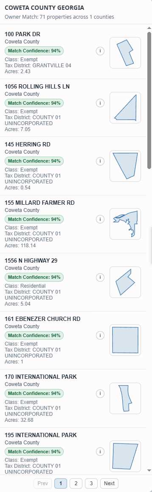
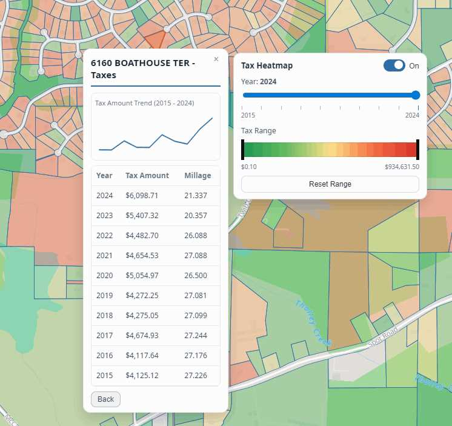
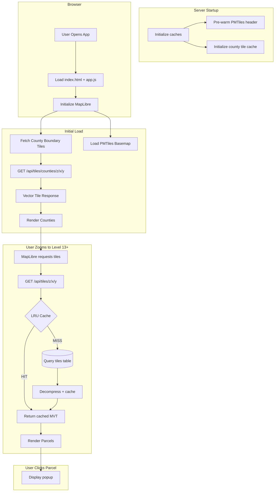

<div align="center">

# Georgia Parcel Map

**Interactive map visualization for Georgia's 4.77 million property parcels across all 159 counties**

[](https://parcels.renderyourworld.com)


[](https://protomaps.com)
[](https://goreportcard.com/report/github.com/renderyourworld/parcel_heatmap)
<br/>

[How It Works](#how-it-works) • [Tech Stack](#tech-stack) • [Database Design](#database-design) • [Performance](#performance) • [CLI Usage](#cli-usage) • [Project Structure](#project-structure)


<p>
A statewide Georgia parcel map with fast tile serving, search, parcel detail popup, owner reverse-search, and tax heatmap.
Built with Go, PostgreSQL/PostGIS, and MapLibre GL JS.
</p>
</div>

## Screenshots

<div align="center">
  <table>
    <tr>
      <td align="center">
        <br>
        <em>County + parcel boundaries</em>
      </td>
      <td align="center">
        <br>
        <em>Parcel details popup</em>
      </td>
    </tr>
    <tr>
      <td align="center">
        <br>
        <em>Owner reverse search results</em>
      </td>
      <td align="center">
        <br>
        <em>Tax heatmap (grid + parcel)</em>
      </td>
    </tr>
  </table>
</div>

## How It Works

When a user loads the map, data flows through multiple optimized layers:



### Key Data Flow Points

1. **County Boundaries**: Pre-generated MVT vector tiles, served directly from PostgreSQL with in-memory tile caching
2. **Basemap**: OSM data served via PMTiles with range-request caching
3. **Vector Tiles**: Pre-generated MVT tiles stored gzipped in PostgreSQL, cached in an LRU after first access
4. **Parcel Properties**: Lightweight fields are embedded in vector tiles; full parcel details hydrate on click via `/api/parcels/:feature_id`
5. **Search**: Address/owner autocomplete queries PostgreSQL via `/api/search/parcels`, then `flyTo` + parcel highlight + popup hydration

---

## Tech Stack

| Layer | Technology | Purpose |
|-------|------------|---------|
| **Backend** | Go + Gin | HTTP server, API handlers, import orchestration |
| **Database** | PostgreSQL + PostGIS | Spatial data storage, geometry operations, tile generation |
| **Frontend** | MapLibre GL JS | Vector tile rendering, interactive map |
| **Tiles** | MVT + PMTiles | Efficient vector tile delivery |
| **Caching** | LRU (in-memory) | Tile and PMTiles chunk caching |

---

## Database Design

The application uses PostgreSQL with the PostGIS extension for spatial data. The schema is optimized for read-heavy workloads with precomputed columns and strategic indexing.

📖 **[Full Database Documentation →](db/README.md)**

### Core Tables

| Table | Purpose | Records |
|-------|---------|---------|
| `counties` | Georgia county boundaries and metadata | 159 |
| `parcels` | Individual property parcels with geometry | ~4.77M |
| `parcel_taxes` | Historical tax records + bill detail fields per parcel/year | Growing |
| `tiles` | Pre-generated MVT vector tiles | ~48M |
| `county_field_mappings` | Maps source API fields to our schema | Variable |
| `parcel_class_codes` | Land use classification codes per county | Variable |
| `import_checkpoints` | Tracks import progress for resumability | Variable |

### Key Optimizations

- **County Vector Tiles**: County boundaries are served as pre-generated MVT tiles (`/api/tiles/counties/:z/:x/:y`) instead of runtime GeoJSON serialization
- **GiST Spatial Indexes**: Geometry columns are indexed for fast spatial filtering during tile generation and spatial queries
- **Pre-generated Tiles**: Parcel/county/tax tiles are generated once and stored gzipped in PostgreSQL, avoiding per-request geometry processing
- **In-memory Tile Caching**: Hot county/parcels/tax tiles are cached in memory to minimize database reads and decompression overhead

---

## Performance

| Metric | Value | Notes |
|--------|-------|-------|
| County Tiles (cached) | <1ms | Served from in-memory county tile cache |
| County Tiles (cold) | ~5-10ms | Read gzipped MVT from PostgreSQL + decompress |
| Vector Tile (cached) | <1ms | LRU cache hit |
| Vector Tile (cold) | ~5-10ms | Database query + decompress |
| Initial Page Load | ~35ms | Simplified boundaries + basemap |

### Optimization Strategies

1. **Precomputation over Runtime**: Expensive operations (geometry serialization, tile generation) happen at import time, not request time
2. **Multi-layer Caching**: LRU caches for both MVT tiles and PMTiles chunks reduce database load
3. **Gzip Storage**: Tiles stored compressed, decompressed only when served (or cached uncompressed)
4. **Zoom-based Detail**: Simplified geometries at low zoom, full detail only when needed

### Parcel Tile Payload Optimization

Parcel polygon tiles were optimized by trimming embedded attributes to only the fields needed for map rendering:

- `feature_id`
- `site_address`
- `acres`

Detailed parcel fields are now fetched on click from a live endpoint (`/api/parcels/:feature_id`) and used to hydrate the popup. This dramatically reduced tile payload size and improved map pan/zoom responsiveness.

| Zoom | Before | After |
|:----:|-------:|------:|
| 13 | 307 kB | 30 kB |
| 14 | 93 kB | 9,203 B |
| 15 | 29 kB | 2,923 B |
| 16 | 9,458 B | 1,036 B |
| 17 | 3,151 B | 425 B |
| 18 | 1,275 B | 246 B |
| 19 | 679 B | 182 B |

### Property Tax Heatmap Architecture

The property tax heatmap intentionally uses two render modes:

1. **Grid Heatmap (zoom 6-12)**  
   Precomputed yearly tiles (`layer = tax_heatmap_<year>`) store aggregated `avg_tax_amount` values per grid cell.

2. **Parcel Heatmap (zoom 13-19)**  
   Runtime vector tiles (`/api/tiles/tax-parcels/:z/:x/:y`) carry parcel geometry + per-year `tax_amount`.

Why both layers exist:

- A parcel-only heatmap is too heavy at county scale.
- A grid-only heatmap loses parcel-level detail at high zoom.
- The split keeps low-zoom performance fast while preserving high-zoom fidelity.

### Search Optimization

The map includes a single search bar with mode toggle (`Address` / `Owner`) for fast parcel lookup:

- **Endpoint**: `/api/search/parcels?q=...&mode=address|owner&limit=10`
- **Strategy**: prefix match first, trigram similarity fallback for longer queries
- **Scope**: Georgia parcels only
- **Result behavior**: selecting a result flies to the parcel, highlights it, and opens the hydrated parcel popup

Database-side search performance improvements:

- `pg_trgm` extension for fuzzy matching
- Precomputed `search_lat` / `search_lng` columns on `parcels` (trigger-maintained on geometry changes)
- Address search uses the dedicated `parcel_search` projection table with prefix + trigram indexes on normalized address fields
- Owner search uses partial prefix + trigram indexes on `parcels.owner_name` aligned to active filters (`processed IS NULL`, `objectid IS NOT NULL`, non-null coords/text)

### Reverse Owner Search

The `Properties by Owner` workflow uses:

- **Endpoint**: `/api/owners/properties?feature_id={county_id}_{objectid}` (preferred)  
- **Fallback endpoint mode**: `/api/owners/properties?owner_name=...&owner_address=...`

Runtime behavior is two-stage:

1. **Materialized fast path**  
   If the anchor parcel is present in `owner_group_members` and the group returns at least 2 parcels, results are served from precomputed owner groups.

2. **Dynamic hybrid scoring fallback**  
   If materialized data is missing/incomplete, the API runs statewide candidate selection and computes a `match_confidence` score per parcel.

Current scoring signals include:

- Owner address normalization matches (strict and relaxed)
- House/street/city/ZIP combinations
- Owner-name similarity (exact, subset, overlap)
- PO Box penalties for ambiguity
- Surname mismatch penalty when address evidence is weak
- Small county/proximity tie-breakers

Results are filtered by confidence threshold and returned with:

- `match_confidence` (0-100)
- `match_band` (`high` >= 85, `medium` >= 55, else `low`)

### Tile Cache Configuration

The application uses a **zoom-aware LRU cache** with ~200MB total memory budget. Lower zoom levels receive more cache space because they contain more data per tile and are more expensive to regenerate:

| Zoom | Memory Quota | Avg Tile Size | ~Tile Capacity |
|:----:|-------------:|--------------:|---------------:|
| 13 | 90 MB | 30 KB | ~3,100 tiles |
| 14 | 48 MB | 9,203 B | ~5,500 tiles |
| 15 | 32 MB | 2,923 B | ~11,500 tiles |
| 16 | 16 MB | 1,036 B | ~16,200 tiles |
| 17 | 8 MB | 425 B | ~19,700 tiles |
| 18 | 4 MB | 246 B | ~17,100 tiles |
| 19 | 2 MB | 182 B | ~11,500 tiles |

This design ensures that the most expensive tiles (low zoom with many parcels) stay cached longer, while high-zoom tiles with fewer parcels are evicted more aggressively since they're cheap to regenerate.

### Additional Heatmap Caches

The server also maintains dedicated in-memory caches for heatmap traffic:

- **Tax Heatmap Grid Cache** (`tax_heatmap_<year>` responses): ~96MB
- **Tax Parcel Tile Cache** (`/api/tiles/tax-parcels/...` responses): ~160MB

These are separate from the base parcel tile LRU because grid and parcel-heatmap tiles have different payload sizes, access patterns, and keys (`year`, and for parcel heatmap also `county_id`).

---

## CLI Usage

```bash
# Start the web server
go run main.go

# Import parcels for a specific county
go run main.go --import-parcels --county "Fulton"

# Resume an interrupted import
go run main.go --import-parcels --county "Fulton" --resume

# Import multiple counties (comma-separated)
go run main.go --import-parcels --county "Fulton,DeKalb,Gwinnett"

# Skip tile generation after import (for testing)
go run main.go --import-parcels --county "Fulton" --skip-tiles

# Generate vector tiles for a county (zoom levels 13-19)
go run main.go --generate-tiles --county "Fulton"

# Generate tiles for all counties
go run main.go --generate-tiles --county "all"

# Generate tiles with custom zoom range
go run main.go --generate-tiles --county "Fulton" --min-zoom 13 --max-zoom 16

# Generate tax heatmap grid tiles (tax_amount-based) for all supported years
go run main.go --generate-tax-heatmap-tiles --county "Forsyth"

# Generate tax heatmap grid tiles for a single tax year
go run main.go --generate-tax-heatmap-tiles --county "Forsyth" --tax-year 2024

# Import with verbose logging to file
go run main.go --import-parcels --county "Fulton" --log
```

### Import Process

The parcel import system is designed for reliability:

- **Checkpointing**: Progress is saved to the database, allowing interrupted imports to resume
- **Rate Limiting**: Built-in delays prevent overwhelming source APIs
- **Retry Logic**: Failed requests are retried with exponential backoff
- **Field Mapping**: Per-county field mappings handle varying source schemas

---

## Project Structure

```
parcel_heatmap/
├── main.go              # Entry point, CLI flag handling, server setup
├── app.js               # Frontend MapLibre application
├── index.html           # Main HTML entry point
│
├── db/
│   ├── database.go      # Database connection and initialization
│   └── migrations/      # SQL migration files
│
├── handlers/
│   ├── county.go        # County boundary API endpoints
│   ├── parcel.go        # Live parcel detail endpoint for popup hydration
│   ├── search.go        # Parcel address/owner search endpoint
│   └── tiles.go         # Vector tile serving with caching
│
├── importers/
│   ├── ga_counties.go   # County boundary import from SAGIS
│   ├── parcel_importer_gis.go    # ArcGIS REST API importer
│   ├── parcel_importer_qpublic.go # QPublic/Beacon importer
│   ├── tax_importer.go  # Property tax data import (in progress)
│   └── field_mapper.go  # Dynamic field mapping system
│
├── models/              # GORM model definitions
├── tiles/
│   ├── generator.go     # MVT tile generation using PostGIS
│   └── cache.go         # LRU cache implementation
│
└── utils/               # Shared utilities (compression, logging, etc.)
```

---

## Acknowledgments

- **[Georgia SAGIS](https://sagis.org/)** - County boundary data
- **[Protomaps](https://protomaps.com/)** - PMTiles basemap
- **[OpenStreetMap](https://www.openstreetmap.org/)** - Map data
- **[PostGIS](https://postgis.net/)** - Spatial database capabilities
- **[MapLibre GL JS](https://maplibre.org/)** - Map rendering


