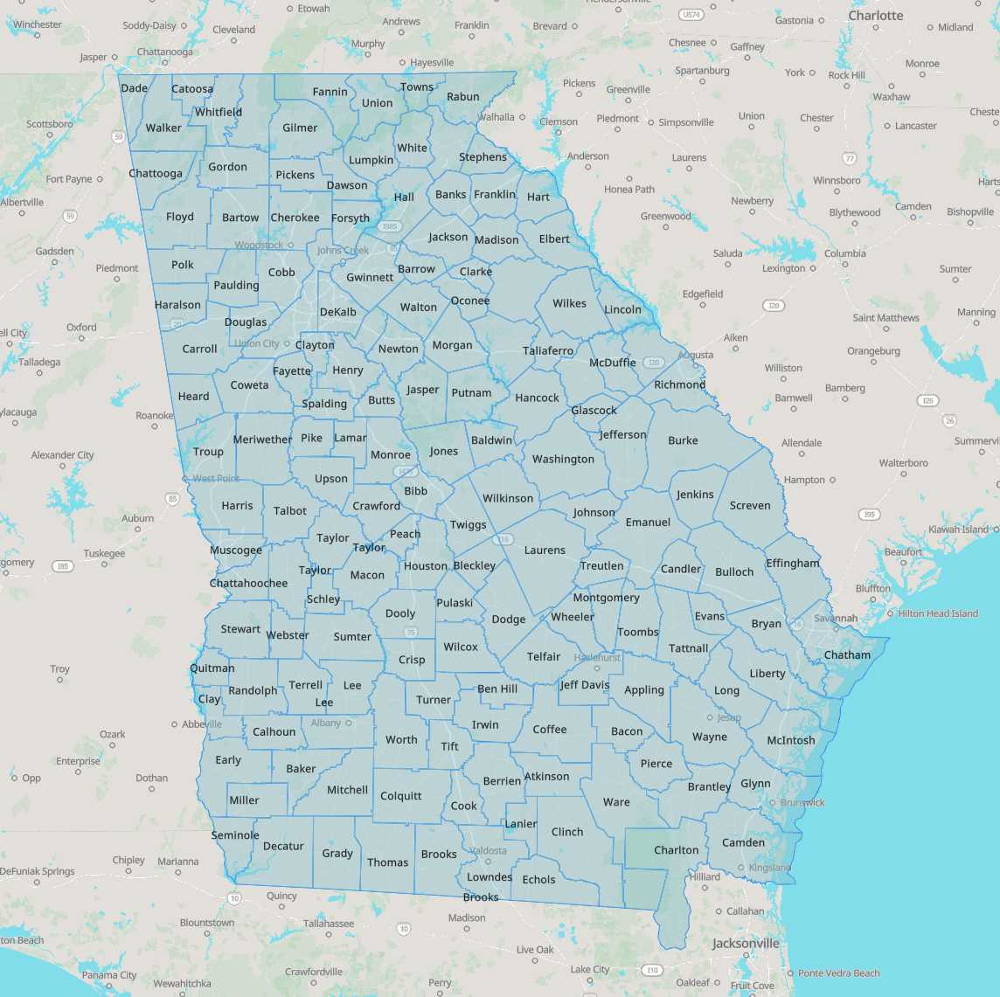
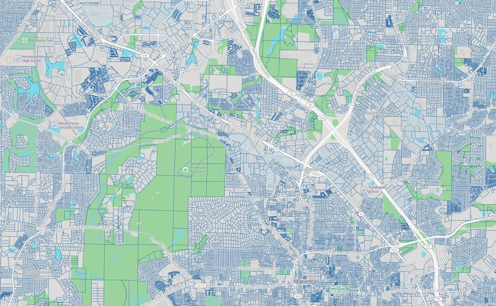
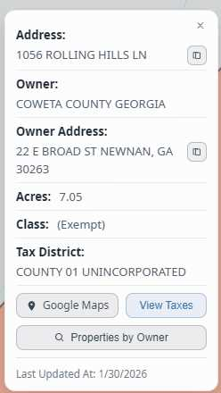
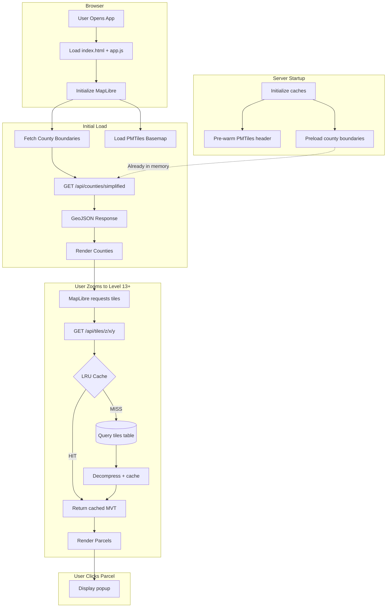

<div align="center">

# Georgia Parcel Map

**Interactive map visualization for Georgia's 4.77 million property parcels across all 159 counties**

[](https://parcels.renderyourworld.com)




</div>

A full-stack geospatial web application for visualizing Georgia county boundaries and parcel data. Built with Go, PostgreSQL/PostGIS, and MapLibre GL JS.

| Metric | Value |
|--------|-------|
| **Counties** | 159 (100% of Georgia) |
| **Parcels** | 4,769,152 |
| **Coverage** | Complete statewide |

---

## Screenshots

| State View | County Parcels | Parcel Details |
|:----------:|:--------------:|:--------------:|
|  |  |  |
| *All 159 counties* | *Individual parcels visible at zoom 13+* | *Property info on click* |

---

## How It Works

When a user loads the map, data flows through multiple optimized layers:



### Key Data Flow Points

1. **County Boundaries**: Pre-serialized as GeoJSON in the database, served directly without per-request geometry conversion
2. **Basemap**: OSM data served via PMTiles with range-request caching
3. **Vector Tiles**: Pre-generated MVT tiles stored gzipped in PostgreSQL, cached in an LRU after first access
4. **Parcel Properties**: Embedded in vector tiles, no additional API calls needed on click

---

## Tech Stack

| Layer | Technology | Purpose |
|-------|------------|---------|
| **Backend** | Go + Gin | HTTP server, API handlers, import orchestration |
| **Database** | PostgreSQL + PostGIS | Spatial data storage, geometry operations, tile generation |
| **Frontend** | MapLibre GL JS | Vector tile rendering, interactive map |
| **Tiles** | MVT + PMTiles | Efficient vector tile delivery |
| **Caching** | LRU (in-memory) | Tile and PMTiles chunk caching |

---

## Database Design

The application uses PostgreSQL with the PostGIS extension for spatial data. The schema is optimized for read-heavy workloads with precomputed columns and strategic indexing.

### Core Tables

| Table | Purpose | Records |
|-------|---------|---------|
| `counties` | Georgia county boundaries and metadata | 159 |
| `parcels` | Individual property parcels with geometry | ~4.77M |
| `parcel_taxes` | Historical tax records per parcel | Growing |
| `tiles` | Pre-generated MVT vector tiles | ~47M |
| `county_field_mappings` | Maps source API fields to our schema | Variable |
| `parcel_class_codes` | Land use classification codes per county | Variable |
| `import_checkpoints` | Tracks import progress for resumability | Variable |

### Key Optimizations

- **Precomputed GeoJSON**: County boundaries are pre-serialized to JSONB via database triggers, eliminating expensive `ST_AsGeoJSON()` calls per request
- **GiST Spatial Indexes**: All geometry columns are indexed for fast spatial queries
- **Pre-generated Tiles**: Vector tiles are generated once and stored gzipped, avoiding real-time geometry processing
- **Simplified Geometries**: County boundaries have both full and simplified versions (`ST_Simplify`) for zoom-appropriate rendering

📖 **[Full Database Documentation →](db/README.md)**

---

## Performance

| Metric | Value | Notes |
|--------|-------|-------|
| Simplified Counties | ~15-20ms | Precomputed JSONB served directly |
| Full Counties (cached) | ~2ms | Served from memory after first request |
| Vector Tile (cached) | <1ms | LRU cache hit |
| Vector Tile (cold) | ~5-10ms | Database query + decompress |
| Initial Page Load | ~35ms | Simplified boundaries + basemap |

### Optimization Strategies

1. **Precomputation over Runtime**: Expensive operations (geometry serialization, tile generation) happen at import time, not request time
2. **Multi-layer Caching**: LRU caches for both MVT tiles and PMTiles chunks reduce database load
3. **Gzip Storage**: Tiles stored compressed, decompressed only when served (or cached uncompressed)
4. **Zoom-based Detail**: Simplified geometries at low zoom, full detail only when needed

### Tile Cache Configuration

The application uses a **zoom-aware LRU cache** with ~200MB total memory budget. Lower zoom levels receive more cache space because they contain more data per tile and are more expensive to regenerate:

| Zoom | Memory Quota | Avg Tile Size | ~Tile Capacity |
|:----:|-------------:|--------------:|---------------:|
| 13 | 90 MB | 43 KB | ~2,100 tiles |
| 14 | 48 MB | 13 KB | ~3,700 tiles |
| 15 | 32 MB | 4.2 KB | ~7,600 tiles |
| 16 | 16 MB | 1.6 KB | ~10,000 tiles |
| 17 | 8 MB | 713 B | ~11,200 tiles |
| 18 | 4 MB | 450 B | ~8,900 tiles |
| 19 | 2 MB | 355 B | ~5,600 tiles |

This design ensures that the most expensive tiles (low zoom with many parcels) stay cached longer, while high-zoom tiles with fewer parcels are evicted more aggressively since they're cheap to regenerate.

---

## CLI Usage

The server supports various command-line flags for data management:

```bash
# Start the web server
go run main.go

# Import parcels for a specific county
go run main.go --import-parcels --county "Fulton"

# Resume an interrupted import
go run main.go --import-parcels --county "Fulton" --resume

# Import multiple counties (comma-separated)
go run main.go --import-parcels --county "Fulton,DeKalb,Gwinnett"

# Skip tile generation after import (for testing)
go run main.go --import-parcels --county "Fulton" --skip-tiles

# Generate vector tiles for a county (zoom levels 13-19)
go run main.go --generate-tiles --county "Fulton"

# Generate tiles for all counties
go run main.go --generate-tiles --county "all"

# Generate tiles with custom zoom range
go run main.go --generate-tiles --county "Fulton" --min-zoom 13 --max-zoom 16

# Import with verbose logging to file
go run main.go --import-parcels --county "Fulton" --log

# Import county boundaries from SAGIS API
go run main.go --import-counties
```

### Import Process

The parcel import system is designed for reliability:

- **Checkpointing**: Progress is saved to the database, allowing interrupted imports to resume
- **Rate Limiting**: Built-in delays prevent overwhelming source APIs
- **Retry Logic**: Failed requests are retried with exponential backoff
- **Field Mapping**: Per-county field mappings handle varying source schemas

---

## Project Structure

```
parcel_heatmap/
├── main.go              # Entry point, CLI flag handling, server setup
├── app.js               # Frontend MapLibre application
├── index.html           # Main HTML entry point
│
├── db/
│   ├── database.go      # Database connection and initialization
│   └── migrations/      # SQL migration files
│
├── handlers/
│   ├── county.go        # County boundary API endpoints
│   └── tiles.go         # Vector tile serving with caching
│
├── importers/
│   ├── ga_counties.go   # County boundary import from SAGIS
│   ├── parcel_importer_gis.go    # ArcGIS REST API importer
│   ├── parcel_importer_qpublic.go # QPublic/Beacon importer
│   ├── tax_importer.go  # Property tax data import
│   └── field_mapper.go  # Dynamic field mapping system
│
├── models/              # GORM model definitions
├── tiles/
│   ├── generator.go     # MVT tile generation using PostGIS
│   └── cache.go         # LRU cache implementation
│
└── utils/               # Shared utilities (compression, logging, etc.)
```

---

## Acknowledgments

- **[Georgia SAGIS](https://sagis.org/)** - County boundary data
- **[Protomaps](https://protomaps.com/)** - PMTiles basemap
- **[OpenStreetMap](https://www.openstreetmap.org/)** - Map data
- **[PostGIS](https://postgis.net/)** - Spatial database capabilities
- **[MapLibre GL JS](https://maplibre.org/)** - Map rendering
