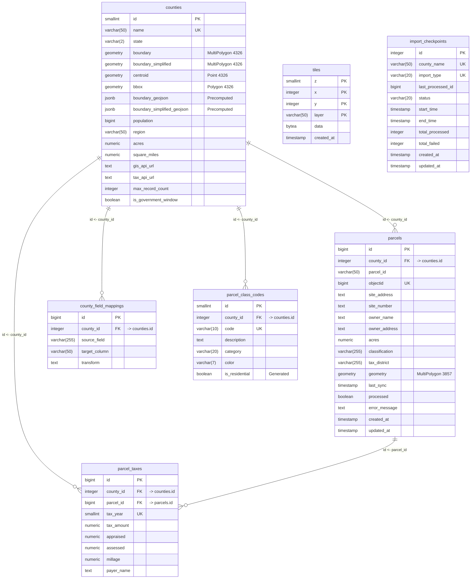

# Database Design

This document provides detailed documentation of the PostgreSQL/PostGIS database schema used.

---

## Overview

The database uses PostgreSQL 18.1 with the PostGIS extension for spatial data operations. The schema is designed for:

- **Read-heavy workloads**: Precomputed columns eliminate expensive per-request calculations
- **Resumable imports**: Checkpoint tracking allows interrupted imports to continue
- **Flexible data sources**: Field mapping tables handle varying source API schemas
- **Efficient tile serving**: Pre-generated vector tiles with gzip compression

---

## Table of Contents

- [Overview](#overview)
- [Entity Relationship Diagram](#entity-relationship-diagram)
- [Tables](#tables)
    - [`counties`](#counties)
    - [`parcels`](#parcels)
    - [`parcel_taxes`](#parcel_taxes)
    - [`tiles`](#tiles)
    - [`county_field_mappings`](#county_field_mappings)
    - [`parcel_class_codes`](#parcel_class_codes)
    - [`import_checkpoints`](#import_checkpoints)
- [Spatial Considerations](#spatial-considerations)
- [Precomputed Columns](#precomputed-columns)
- [Vector Tile Generation](#vector-tile-generation)
- [Performance Metrics](#performance-metrics)

## Entity Relationship Diagram



---

## Tables

### `counties`

Stores Georgia county boundaries and associated metadata. This is the foundation table that all parcel data references.

| Column | Type | Description |
|--------|------|-------------|
| `id` | `smallint` | Primary key (1-159 for Georgia counties) |
| `name` | `varchar(50)` | County name (unique) |
| `state` | `varchar(2)` | State abbreviation (default: 'GA') |
| `boundary` | `geometry(MultiPolygon, 4326)` | Full-resolution county boundary |
| `boundary_simplified` | `geometry(MultiPolygon, 4326)` | Simplified boundary for low-zoom rendering |
| `centroid` | `geometry(Point, 4326)` | Geographic center point |
| `bbox` | `geometry(Polygon, 4326)` | Bounding box envelope |
| `boundary_geojson` | `jsonb` | **Precomputed** full boundary as GeoJSON Feature |
| `boundary_simplified_geojson` | `jsonb` | **Precomputed** simplified boundary as GeoJSON Feature |
| `population` | `bigint` | 2010 census population |
| `region` | `varchar(50)` | Georgia regional commission name |
| `acres` | `numeric` | Total land area in acres |
| `square_miles` | `numeric` | Total land area in square miles |
| `gis_api_url` | `text` | ArcGIS REST API endpoint for parcel data |
| `tax_api_url` | `text` | Tax data API endpoint |
| `max_record_count` | `integer` | API pagination limit (default: 1000) |
| `is_government_window` | `boolean` | Whether county uses Government Window tax platform |

**Indexes:**
- `counties_pkey` - Primary key (btree on `id`)
- `counties_name_key` - Unique constraint (btree on `name`)
- `idx_counties_boundary` - Spatial index (GiST on `boundary`)
- `idx_counties_boundary_simplified` - Spatial index (GiST on `boundary_simplified`)
- `idx_counties_centroid` - Spatial index (GiST on `centroid`)

---

### `parcels`

The main table storing individual property parcels. Contains ~4.77 million records covering all Georgia counties.

| Column | Type | Description |
|--------|------|-------------|
| `id` | `bigint` | Primary key (auto-incrementing) |
| `county_id` | `integer` | Foreign key to `counties.id` |
| `parcel_id` | `varchar(50)` | County-specific parcel identifier |
| `objectid` | `bigint` | Source system object ID (unique per county) |
| `site_address` | `text` | Property street address |
| `site_number` | `text` | Street number (extracted for display) |
| `owner_name` | `text` | Property owner name |
| `owner_address` | `text` | Owner mailing address |
| `acres` | `numeric` | Parcel size in acres |
| `classification` | `varchar(255)` | Land use classification code |
| `tax_district` | `varchar(255)` | Tax jurisdiction district |
| `geometry` | `geometry(MultiPolygon, 3857)` | Parcel boundary in Web Mercator |
| `last_sync` | `timestamp` | Last successful data sync |
| `processed` | `boolean` | NULL=success, FALSE=needs retry |
| `error_message` | `text` | Error details if processing failed |
| `created_at` | `timestamp` | Record creation time |
| `updated_at` | `timestamp` | Last modification time |

**Indexes:**
- `parcels_pkey` - Primary key (btree on `id`)
- `idx_parcels_county_parcel` - Composite index for lookups (btree on `county_id`, `parcel_id`)
- `idx_parcels_geometry` - Spatial index (GiST on `geometry`)
- `parcels_county_id_objectid_key` - Unique constraint per county (btree on `county_id`, `objectid`)

> **Note on SRID**: Parcels use SRID 3857 (Web Mercator) because vector tiles are generated in this projection. County boundaries use SRID 4326 (WGS84) for compatibility with GeoJSON.

---

### `parcel_taxes`

Historical tax records for parcels. Each parcel can have multiple records (one per tax year).

| Column | Type | Description |
|--------|------|-------------|
| `id` | `bigint` | Primary key |
| `county_id` | `integer` | Foreign key to `counties.id` |
| `parcel_id` | `bigint` | Foreign key to `parcels.id` |
| `tax_year` | `smallint` | Tax year (e.g., 2024) |
| `tax_amount` | `numeric` | Total tax owed |
| `appraised` | `numeric(14,2)` | Fair market value |
| `assessed` | `numeric(14,2)` | Assessed value (40% of appraised in GA) |
| `millage` | `numeric(8,6)` | Tax rate as decimal (e.g., 0.032) |
| `payer_name` | `text` | Name of tax payer |

**Indexes:**
- `parcel_taxes_pkey` - Primary key
- `idx_tax_year` - Unique constraint (btree on `parcel_id`, `tax_year`)
- `idx_parcel_taxes_year` - Query optimization (btree on `parcel_id`, `tax_year DESC`)

---

### `tiles`

Pre-generated Mapbox Vector Tiles (MVT) stored as gzipped binary data.

| Column | Type | Description |
|--------|------|-------------|
| `z` | `smallint` | Zoom level (13-19 for parcels) |
| `x` | `integer` | Tile X coordinate |
| `y` | `integer` | Tile Y coordinate |
| `layer` | `varchar(50)` | Layer name (default: 'parcels') |
| `data` | `bytea` | Gzipped MVT binary data |
| `created_at` | `timestamp` | Tile generation time |

**Primary Key:** Composite (`z`, `x`, `y`, `layer`)

**Indexes:**
- `tiles_pkey` - Primary key (btree)
- `idx_tiles_lookup` - Query optimization (btree on `z`, `x`, `y`, `layer`)

**Check Constraints:**
- `z` must be between 0 and 30
- `x` and `y` must be non-negative

---

### `county_field_mappings`

Maps source API field names to our standardized schema. Different counties expose data with different field names.

| Column | Type | Description |
|--------|------|-------------|
| `id` | `bigint` | Primary key |
| `county_id` | `integer` | Foreign key to `counties.id` |
| `source_field` | `varchar(255)` | Field name in source API |
| `target_column` | `varchar(50)` | Column name in `parcels` table |
| `transform` | `text` | Optional transformation rule |

**Example mappings:**
```
Fulton County:   "OWNER1" → "owner_name"
DeKalb County:   "OwnerName" → "owner_name"
Gwinnett County: "OWNER_NAME" → "owner_name"
```

---

### `parcel_class_codes`

Land use classification codes with category and color for map styling.

| Column | Type | Description |
|--------|------|-------------|
| `id` | `smallint` | Primary key |
| `county_id` | `integer` | Foreign key to `counties.id` |
| `code` | `varchar(10)` | Classification code (e.g., "R1", "C2") |
| `description` | `text` | Human-readable description |
| `category` | `varchar(20)` | Category (Residential, Commercial, etc.) |
| `color` | `varchar(7)` | Hex color for map display |
| `is_residential` | `boolean` | Generated column (true if category = 'Residential') |

---

### `import_checkpoints`

Tracks import progress for resumable batch operations.

| Column | Type | Description |
|--------|------|-------------|
| `id` | `integer` | Primary key |
| `county_name` | `varchar(50)` | County being imported |
| `import_type` | `varchar(20)` | Type: 'parcel' or 'tax' |
| `last_processed_id` | `bigint` | Last successfully processed record ID |
| `status` | `varchar(20)` | RUNNING, COMPLETED, or FAILED |
| `start_time` | `timestamp` | Import start time |
| `end_time` | `timestamp` | Import completion time |
| `total_processed` | `integer` | Successfully processed count |
| `total_failed` | `integer` | Failed record count |
| `created_at` | `timestamp` | Checkpoint creation time |
| `updated_at` | `timestamp` | Last checkpoint update |

**Unique Constraint:** (`county_name`, `import_type`)

---

## Spatial Considerations

### Coordinate Reference Systems (SRID)

| Data Type | SRID | Name | Reason |
|-----------|------|------|--------|
| County boundaries | 4326 | WGS84 | Standard for GeoJSON, GPS coordinates |
| Parcel geometries | 3857 | Web Mercator | Required for MVT tile generation |

### Geometry Simplification

County boundaries are stored in two resolutions:

```sql
-- Full resolution (for detailed view)
boundary geometry(MultiPolygon, 4326)

-- Simplified for fast rendering at low zoom
boundary_simplified geometry(MultiPolygon, 4326)
-- Generated with: ST_Simplify(boundary, 0.005)
-- Tolerance of 0.005° ≈ 500m at Georgia's latitude
```

### Spatial Indexes

All geometry columns use GiST (Generalized Search Tree) indexes:

```sql
CREATE INDEX idx_counties_boundary ON counties USING gist(boundary);
CREATE INDEX idx_parcels_geometry ON parcels USING gist(geometry);
```

---

## Precomputed Columns

### The Problem

Converting PostGIS geometries to GeoJSON is expensive:

```sql
-- This is slow when called for 159 counties per request
SELECT ST_AsGeoJSON(boundary) FROM counties;
```

### The Solution

Store pre-serialized GeoJSON as JSONB, computed once at import time:

```sql
-- Precomputed once, served instantly
SELECT boundary_geojson FROM counties;
```

The precomputed GeoJSON includes all properties needed for the frontend:

```json
{
  "type": "Feature",
  "geometry": { "type": "MultiPolygon", "coordinates": [...] },
  "properties": {
    "id": 1,
    "name": "Fulton",
    "state": "GA",
    "population": 920581,
    "region": "Atlanta Regional Commission",
    "acres": 344320,
    "square_miles": 538.0
  }
}
```

---

## Vector Tile Generation

### Overview

Vector tiles are generated using PostGIS's `ST_AsMVT` function and stored pre-compressed in the `tiles` table.

### Generation Flow


### Tile Query Example

```sql
SELECT ST_AsMVT(tile, 'parcels', 4096, 'geom', 'feature_id') AS mvt
FROM (
    SELECT 
        p.id AS feature_id,
        p.parcel_id,
        p.site_address,
        p.owner_name,
        p.acres,
        p.classification,
        ST_AsMVTGeom(
            p.geometry,
            ST_TileEnvelope(z, x, y),
            4096,  -- extent
            256,   -- buffer
            true   -- clip
        ) AS geom
    FROM parcels p
    WHERE ST_Intersects(p.geometry, ST_TileEnvelope(z, x, y))
) AS tile;
```


## Performance Metrics

### Query Performance

| Query Type | Cold | Cached | Notes |
|------------|------|--------|-------|
| All counties (simplified GeoJSON) | 15-20ms | N/A | Served directly from JSONB |
| All counties (full GeoJSON) | 120ms | 2ms | Cached in memory after first request |
| Single tile lookup | 5-10ms | <1ms | LRU cache on hit |
| Parcel by ID | <1ms | N/A | Primary key lookup |
| Parcels in bbox | 10-50ms | N/A | Depends on result count |

### Why Precomputation Matters

```
Without precomputation (runtime ST_AsGeoJSON):
┌────────────────────────────────────────────────┐
│ Request → Query 159 counties → ST_AsGeoJSON() │
│           for each row → Build response       │
│ Time: 150-300ms                               │
└────────────────────────────────────────────────┘

With precomputation (JSONB column):
┌────────────────────────────────────────────────┐
│ Request → SELECT boundary_geojson → Response  │
│ Time: 15-20ms                                 │
└────────────────────────────────────────────────┘
```
